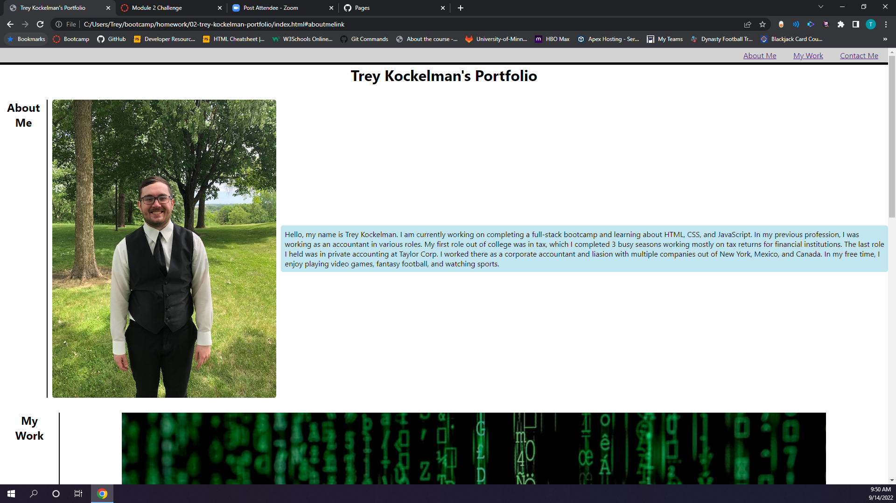

# Trey Kockelman Portfolio

## Description

The purpose of this webpage is to display my work for coding and programming that I have finished and would like prospective employers to see.

## Installation

NA

## Usage

The use of this page is for employers to evaluate my work for coding and programming that I have finished and would like display.

## Credits

NA

## License

Please refer to the LICENSE in the repo.

## Link

https://treykockelman.github.io/02-trey-kockelman-portfolio/

## Screenshot

